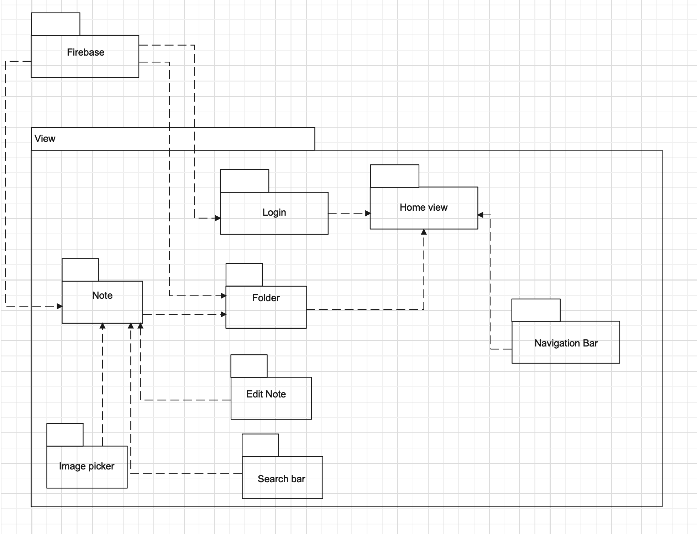
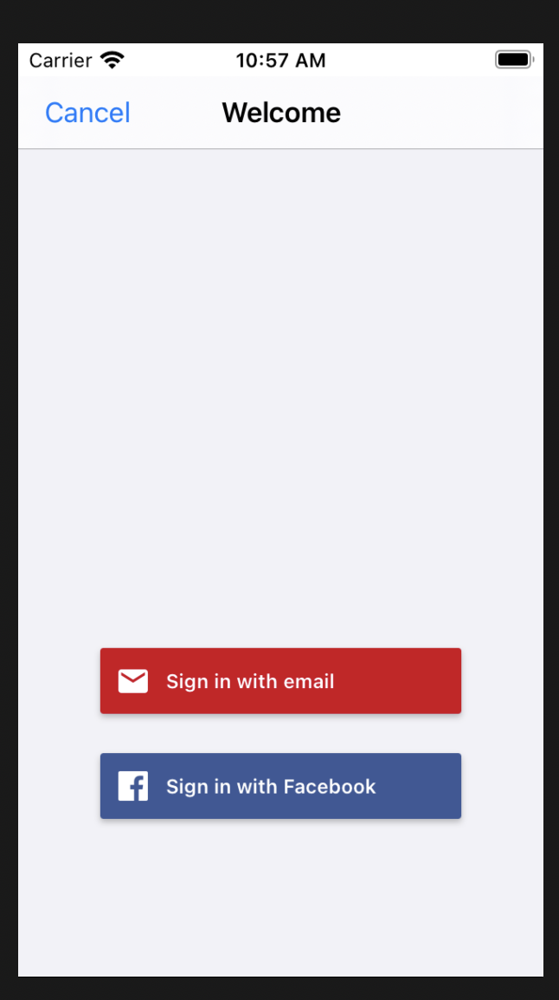

<div align="center" id="top"> 

  &#xa0;
</div>

<h1 align="center"> My Note App </h1>
<br>

## :dart: About ##

MyNotes is apple app using login by facebook anh google email. 

## :sparkles: Features ##

:heavy_check_mark: Able to download and install the app in his/her device;\
:heavy_check_mark: The app will have a nice and distinctive icon after installation;\
:heavy_check_mark: Able to view the list of existing notes. Latest updated notes will be listed first;\
:heavy_check_mark: Able to pin a note to the Pinned section on the top of the list;\
:heavy_check_mark: Able to unpin a note from the Pinned section;\
:heavy_check_mark: Able to add a new note. By default, the note is saved in the folder All;\
:heavy_check_mark: Able to edit an existing note;\
:heavy_check_mark: Able to format text in a note with bold, italics, underline, strike, bulleted list, numbered list, increase indent, decrease indent;\
:heavy_check_mark: Able to insert a photo/video to a note.;\
:heavy_check_mark: Able to delete one or multiple notes;\
:heavy_check_mark: Able to search notes by keywords;\
:heavy_check_mark: Able to move a note to a folder;\
:heavy_check_mark: Able to add/ move/ rename/ delete a folder;\
:heavy_check_mark: Able to send a copy of a note to other users via Microsoft Teams, Facebook Messenger, Whatsapp and Zalo;\
:heavy_check_mark: Able to share a note with other users via Microsoft Teams, Facebook Messenger;\
:heavy_check_mark: Able to edit the shared note at the same time;
## :rocket: Technologies ##

The following tools were used in this project:

- [Firebase]
- [swiftcode]

## Diagram ##



## :white_check_mark: Requirements ##

Before starting :checkered_flag:, you need to have [Git](https://git-scm.com) and [xcode](https://apps.apple.com/us/app/xcode/id497799835?mt=12) installed.

## :checkered_flag: Starting ##

```bash
# Clone this project
$ git clone https://github.com/thanh-nhan1311/ios-note

# Access
$ cd ios-note

# Install dependencies
$ pod install 

# Run the project
```
## The UI show ##


